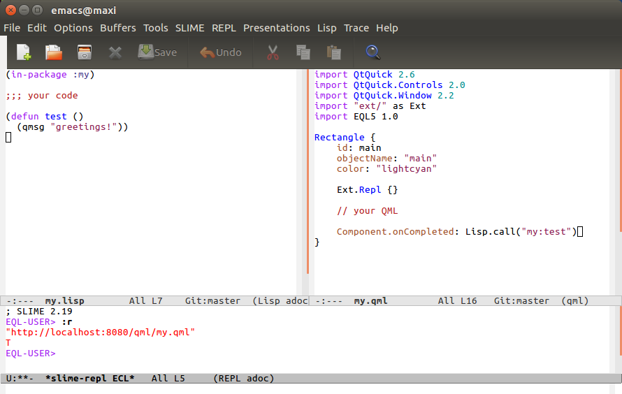

### Info

Explaining this example in one sentence could be:

#### Sketching an android app without installing the (gigantic) dev tools

So, this is just a basic skeleton for interactively developing android apps:
it's perfect for playing around, without installing some GB of development
tools first...

If you want to **use the extreme minimum** (that is, **not** installing any of
NDK, SDK, JDK, ECL, Qt5, EQL5-Android - except the sources of this example),
you can just use the
[APK](http://lights-of-holiness.eu/tmp/my.apk) of this example, plus the
standalone
[adb](https://developer.android.com/studio/releases/platform-tools.html)
command line tool for android, and Emacs/Slime on your PC, plus a python 3
installation (or any trivial web server, see script `web-server.sh`).

* connect your device via USB

* run `$ adb forward tcp:4005 tcp:4005` (port of Swank)

* run `$ adb reverse tcp:8080 tcp:8080` (port of web server)

* in this directory run `$ ./web-server.sh` or `$ web-server.bat` (requires python 3)

Now start the **my** app on android and tap on the REPL switch.

* on the android REPL, eval `:s` (to start Swank)

* on the PC, connect from Slime `M-x slime-connect RET RET`

Now use `lisp/my.lisp` and `qml/my.qml` for development.

* to reload the QML file (after saving the changes) eval `:r` on the PC



The above QML window uses
[qml-mode](https://www.emacswiki.org/emacs/qml-mode.el). In `my.qml` you can
of course link to any other file or picture present on the PC.

In order to evaluate the whole `my.lisp` after restarting the android app, use:

* select all `C-x h`
* eval region `C-c C-r`

**Note**: Sometimes the Slime connection doesn't work the *first time* you try
to connect; just try to connect a second time; if this doesn't work, you
generally need to restart the android app, or sometimes even Emacs.


### Build APK

(this obviously needs a full installation of all tools)

```
  $ ecl-android -shell make.lisp
  $ qmake-android my.pro
  $ make

  $ ./1-copy-libs.sh
  $ ./2-install-lib.sh
  $ ./3-build-apk.sh
```

(a more detailed description can be found in example `../tic-tac-toe`)
